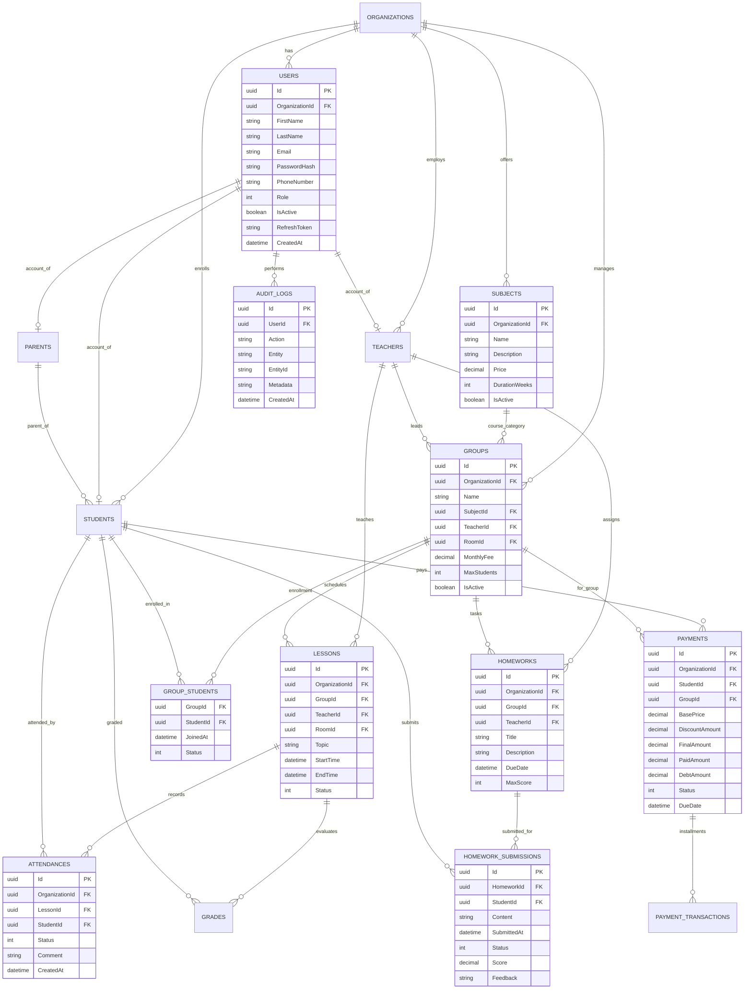

# EduFlow — Ma'lumotlar Modeli (ERD Diagramma)

Ushbu ERD diagrammasi EduFlow platformasining barcha asosiy jadvallari, ularning maydonlari va o‘zaro bog‘lanishlarini (Primary Key, Foreign Key) ko‘rsatadi.

